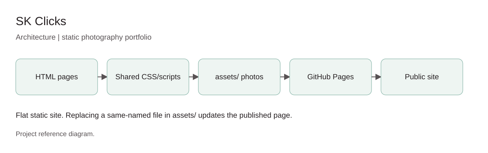

# SK Clicks - project explainer

A static, photo-led photography portfolio: Home, Work, About, Contact. Plain HTML/CSS/JS, no build step, hosted free on GitHub Pages.

## How it works

HTML pages -> shared styles and scripts -> photos in `assets/` -> GitHub Pages -> public site.

## Change a photograph

Upload a new JPEG to `assets/` with the same filename as the one it replaces and commit. Pages redeploys automatically.

## What this is not

No backend, no database, no login. The public repo contains only site code and public photographs.

